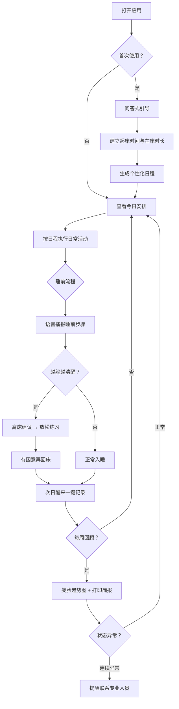

## 1. 产品概述

一款面向中老年人及其家属的平板端失眠认知行为治疗（CBT-I）排程工具，以"大字、少步骤、可代操作"为核心设计原则，帮助老人按照 CBT-I 标准流程建立健康睡眠节律，同时让家属在"陪伴不越界"的框架下提供协助。产品通过问答式引导、一键记录、语音播报、内置放松练习和可视化回顾，降低 CBT-I 的执行门槛，提升治疗依从性。

- 目标用户：50 岁以上有失眠困扰的中老年人，及其成年子女/照护者
- 核心价值：把专业 CBT-I 简化为可操作的日常排程，让老人"跟着走就行"，家属只做陪伴不越界

## 2. 核心功能

### 2.1 用户角色

| 角色 | 进入方式 | 核心权限 |
|------|----------|----------|
| 长者 | 默认进入 | 查看今日安排、记录睡眠、使用放松练习、查看阶段回顾 |
| 家属 | 输入协助密码进入 | 代填睡眠记录（不可修改历史）、查看/打印回顾简报、接收异常提醒 |

### 2.2 功能模块

1. **今日安排**：今日 CBT-I 日程一览、固定起床时间显示、午睡提醒、晚饭后散步提示、睡前流程语音播报入口、离床建议触发
2. **睡眠记录**：一键记录昨晚入睡时间、醒来次数、今日犯困程度、服药备注
3. **家属协助**：协助密码验证、代填记录入口、历史修改锁定、异常状态提醒推送
4. **放松练习**：舒缓呼吸引导、渐进式肌肉放松、轻音乐播放、离床活动建议
5. **阶段回顾**：每周笑脸/颜色趋势图、打印式简报导出、服药变化标注、连续异常提醒联系专业人员

### 2.3 页面详情

| 页面名称 | 模块名称 | 功能描述 |
|----------|----------|----------|
| 今日安排 | 日程卡片 | 显示今日固定起床时间、在床时长窗口、午睡时段提醒、散步提示，每项配大号图标和通俗文案 |
| 今日安排 | 睡前流程 | 语音播报式睡前准备步骤（关屏→洗漱→呼吸→上床），可逐条播放 |
| 今日安排 | 离床建议 | 当用户报告"越躺越清醒"时，弹出口语化建议"起来做点放松的事"，引导至放松练习 |
| 今日安排 | 初始问答 | 首次使用时通过问答式引导建立固定起床时间和在床时长 |
| 睡眠记录 | 快速记录 | 大按钮一键选择：昨晚几点睡（滑块或大时段按钮）、醒了几次（0-5大按钮）、今天是否犯困（笑脸/平脸/困脸） |
| 睡眠记录 | 服药备注 | 可选填安眠药/助眠药物变化备注，与睡眠数据分离显示，避免误判排程效果 |
| 睡眠记录 | 通俗术语 | 自动将"睡眠效率""刺激控制"等专业术语替换为"睡得好不好""床只用来睡觉"等通俗说法 |
| 家属协助 | 密码验证 | 简单4位数字密码，防止误操作 |
| 家属协助 | 代填入口 | 家属可帮老人填写当日记录，但标注"由家属代填" |
| 家属协助 | 历史锁定 | 超过24小时的记录不可修改，防止越界篡改 |
| 家属协助 | 异常提醒 | 连续3天以上状态异常时，弹出"建议联系专业人员"提示 |
| 放松练习 | 呼吸引导 | 4-7-8呼吸法动画，配合大号文字倒计时和柔和音效 |
| 放松练习 | 肌肉放松 | 渐进式肌肉放松引导，从脚到头逐部位文字+语音提示 |
| 放松练习 | 轻音乐 | 内置3首舒缓轻音乐，大播放按钮，15/30/45分钟定时关闭 |
| 放松练习 | 离床活动 | "越躺越清醒"时推荐的低刺激活动列表（翻书、听音乐等） |
| 阶段回顾 | 周趋势图 | 用笑脸😊/平脸😐/困脸😴和绿/黄/红色块展示每周睡眠改善趋势 |
| 阶段回顾 | 打印简报 | 一键生成可打印的A4简报，含周数据、服药备注、趋势图，方便线下与医生沟通 |
| 阶段回顾 | 服药标注 | 在趋势图上标注服药变化节点，帮助区分药物效果与排程效果 |
| 阶段回顾 | 专业提醒 | 连续多日睡眠效率低于阈值或觉醒次数过高时，醒目提示"建议联系专业睡眠医生" |

## 3. 核心流程

### 3.1 首次使用流程
用户打开应用 → 进入问答式引导 → 逐步回答"您通常几点起床？""您希望几点上床？"→ 系统计算在床时长窗口 → 生成个性化日程 → 进入今日安排

### 3.2 日常使用流程
打开应用 → 查看今日安排 → 按日程执行 → 睡前开启语音播报流程 → 次日醒来一键记录昨晚睡眠 → 每周查看阶段回顾

### 3.3 家属协助流程
家属点击"家属协助" → 输入4位密码 → 代填当日记录 → 查看趋势/打印简报 → 退出协助模式

### 3.4 离床建议流程
用户在睡前流程中报告"越躺越清醒" → 系统弹出离床建议 → 引导至放松练习 → 完成放松后提示"有困意再回床"

## 4. 用户界面设计

### 4.1 设计风格

- **主色调**：暖色系 — 米白底色（#FFF8F0）、暖棕主色（#8B6F47）、柔橙强调色（#E8985E）、安眠蓝辅色（#6B9BD2）
- **按钮风格**：大圆角（16px）、厚实阴影、3D凸起感、最小触摸目标 60×60px
- **字体与字号**：标题 32px、正文 24px、辅助文字 20px，使用无衬线中文字体（思源黑体/Noto Sans SC），行间距 1.8
- **布局风格**：底部大图标导航栏、卡片式内容区域、大量留白、左对齐为主
- **图标/表情**：使用大号简洁图标 + 表情符号辅助（😊😐😴），避免纯文字表述
- **动效**：温和淡入淡出，避免快速闪烁，呼吸练习配合缓慢脉动动画

### 4.2 页面设计概览

| 页面名称 | 模块名称 | UI元素 |
|----------|----------|--------|
| 今日安排 | 日程卡片 | 大号时间显示、图标+通俗文字、暖色卡片、午睡/散步提醒浮动提示 |
| 今日安排 | 睡前流程 | 大号播放按钮、步骤进度条、语音波形动画、逐条高亮当前步骤 |
| 今日安排 | 离床建议 | 全屏柔和弹窗、大号友好文字、跳转放松练习的大按钮 |
| 今日安排 | 初始问答 | 居中大号问题文字、大按钮选项、进度指示（第几步/共几步） |
| 睡眠记录 | 快速记录 | 大号滑块/时段按钮、笑脸选择器、一键提交大按钮 |
| 睡眠记录 | 服药备注 | 折叠式备注区、小字提示"可选填" |
| 家属协助 | 密码验证 | 4个大号数字输入框、数字键盘 |
| 家属协助 | 代填记录 | 同睡眠记录界面，顶部标注"代填模式"橙色横幅 |
| 家属协助 | 异常提醒 | 醒目红色/橙色横幅、大号文字提醒 |
| 放松练习 | 练习选择 | 3个大号卡片（呼吸/肌肉/音乐），每卡配图标和简短说明 |
| 放松练习 | 呼吸引导 | 全屏动画圆圈（吸/停/呼）、大号倒计时文字、柔和配色 |
| 放松练习 | 肌肉放松 | 逐部位文字+语音、身体轮廓图高亮当前部位、进度条 |
| 放松练习 | 轻音乐 | 大播放/暂停按钮、3首曲目标签页、定时关闭选项 |
| 阶段回顾 | 周趋势图 | 大号笑脸行+颜色方块行、日期标签、服药变化小三角标注 |
| 阶段回顾 | 打印简报 | 打印预览卡片、一键打印/导出按钮 |
| 阶段回顾 | 专业提醒 | 醒目橙色弹窗、联系电话建议、关闭按钮 |

### 4.3 响应式设计

- 平板优先设计（768px-1366px），横屏竖屏均适配
- 触摸优化：所有可交互元素最小 60px 触摸区域，按钮间距 ≥ 16px
- 支持系统字体放大（尊重系统级无障碍设置）
- 深色模式适配（暖色调深色，避免纯黑）

### 4.4 无障碍设计

- 语音播报：所有关键内容支持语音朗读
- 高对比度：文字与背景对比度 ≥ 4.5:1
- 节奏控制：动画速度可调，默认缓慢
- 触觉反馈提示文字替代方案
