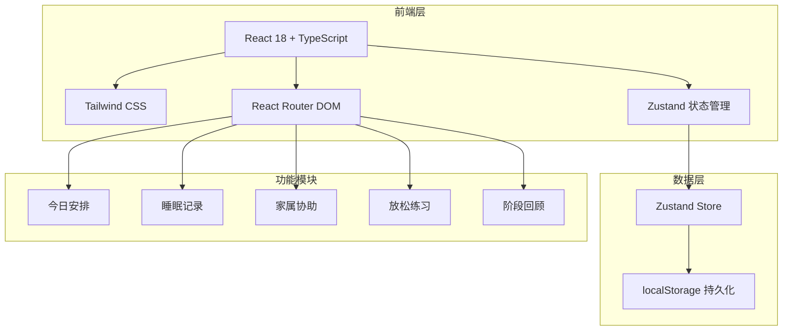
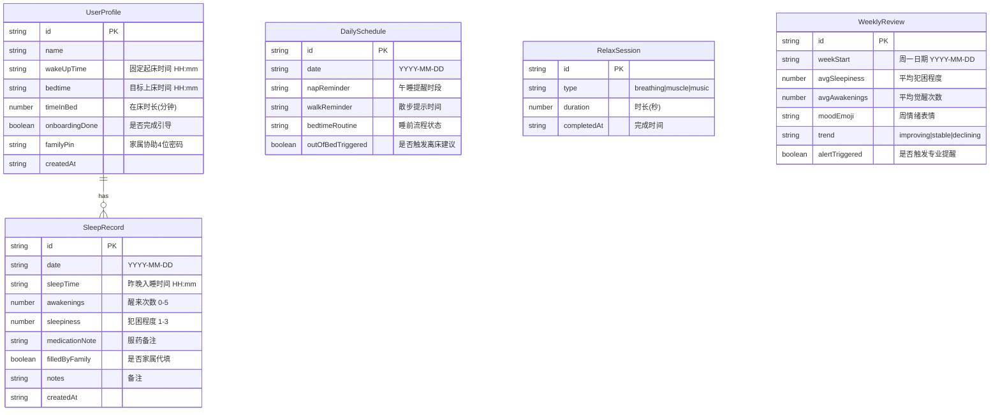

## 1. 架构设计



本产品为纯前端应用，不依赖后端服务。所有数据存储在浏览器 localStorage 中，确保离线可用，降低中老年人的使用门槛。

## 2. 技术说明

- **前端框架**：React 18 + TypeScript + Vite
- **样式方案**：Tailwind CSS 3
- **状态管理**：Zustand（含 persist 中间件，自动持久化到 localStorage）
- **路由方案**：React Router DOM v6
- **图标库**：lucide-react
- **音频处理**：Web Audio API（呼吸音效、轻音乐）
- **语音播报**：Web Speech API（SpeechSynthesis）
- **打印功能**：window.print() + CSS @media print
- **数据存储**：localStorage（Zustand persist 中间件自动管理）
- **无后端/无数据库**：纯客户端应用

## 3. 路由定义

| 路由 | 用途 |
|------|------|
| `/` | 首次使用问答引导页面 |
| `/today` | 今日安排主页面 |
| `/sleep-log` | 睡眠记录页面 |
| `/family` | 家属协助页面（需密码验证） |
| `/relax` | 放松练习页面 |
| `/review` | 阶段回顾页面 |

## 4. 数据模型

### 4.1 数据模型定义



### 4.2 数据定义

所有数据通过 Zustand persist 中间件自动序列化到 localStorage，无需 DDL 语句。数据结构以 TypeScript 接口定义：

```typescript
interface UserProfile {
  id: string;
  name: string;
  wakeUpTime: string;
  bedtime: string;
  timeInBed: number;
  onboardingDone: boolean;
  familyPin: string;
  createdAt: string;
}

interface SleepRecord {
  id: string;
  date: string;
  sleepTime: string;
  awakenings: number;
  sleepiness: number;
  medicationNote: string;
  filledByFamily: boolean;
  notes: string;
  createdAt: string;
}

interface DailySchedule {
  id: string;
  date: string;
  napReminder: string;
  walkReminder: string;
  bedtimeRoutine: string;
  outOfBedTriggered: boolean;
}

interface RelaxSession {
  id: string;
  type: 'breathing' | 'muscle' | 'music';
  duration: number;
  completedAt: string;
}
```
